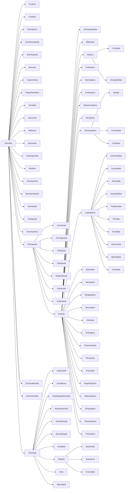

# bold-fast-align

Align all COI DNA barcodes to reference sequences. Goal is not a full multiple sequence alignment, but rather getting the “span” of a barcode relative to a reference sequence. This can be used to visualise the coverage of the COI gene in a set of barcodes.

## Cases to check

- GBSP14138-19 long sequence short alignment

## Reference sequences

The reference sequences come from the [MACSE Barcode Alignments](https://doi.org/10.5281/zenodo.14185813) described in [Accurate alignment of (meta)barcoding data sets using MACSE](https://doi.org/10.5281/zenodo.14185826). Note also that the reference sequence for the COI sequence for *Solenopsis geminata* [NC_014669.1](https://www.ncbi.nlm.nih.gov/nuccore/NC_014669.1?report=fasta&from=1&to=1528) is not available from the MACSE website and has been added here. The sequences, accession numbers, and taxonomic group are all in the file `macse.csv`.

### Taxonomic classification

The taxonomic classification of the reference sequences in `macse.csv` mostly follows BOLD, but some names are different:

| Name in macse | name in BOLD |
|--|--|
| Cephalochordata | Leptocardii |
| Tunicata | Ascidiacea | 
| Cyclostomata | Cephalaspidomorphi |
| Chondrichthyes | Elasmobranchii |
| Lepidosauria | Squamata |
 
The BOLD names have been added to the column `bold_taxon`. The rank for all taxa has been added as the column `bold_rank`. To visualise the classification I connected parent and child taxa to form a tree:

The tree made it clear that `macse.csv` lacked reference sequences for a number of internal nodes (Animalia, Arthropoda, Chordata, Insecta, and Reptilia). I have added these as below.

| Higher taxon | reference sequence |
|--|--|
|Animalia | Drosophila_pseudoobscura_NC_046603_COI |
|Arthropoda | Drosophila_pseudoobscura_NC_046603_COI |
|Chordata | Homo_sapiens_NC_012920_COI |
|Insecta | Drosophila_pseudoobscura_NC_046603_COI |
|Reptilia | Tarentola_mauritanica_NC_012366_COI |

Hence we should be able to provide a reference sequence for any animal COI in BOLD.

## Alignment

The idea is to use Smith-Waterman Alignment to align a barcode with the reference sequence. The goal is to locate the start and the end of the barcode w.r.t. the reference sequence. Initially I used PHP for this, but then got Claude to port that code to C++. This code is in `src`.

## Data

The data is expected to be a TSV file from a BOLD data package. The script `

## Reading

Delsuc, F., & Ranwez, V. (2020). Accurate alignment of (meta)barcoding data sets using MACSE. In Phylogenetics in the Genomic Era. No commercial publisher | Authors open access book. https://doi.org/10.5281/zenodo.14185826

Delsuc, F., & Ranwez, V. (2024). MACSE Barcode Alignments [Data set]. Zenodo. https://doi.org/10.5281/zenodo.14185813